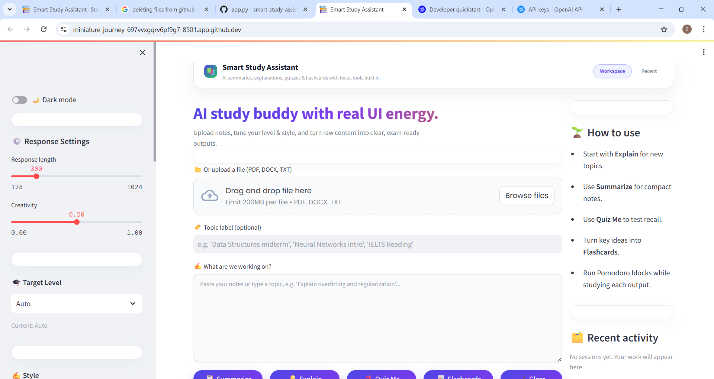

<div align="center">

# 🎓 **Smart Study Assistant**
### _AI-Powered Learning Dashboard for Students_

**Summarize • Explain • Quiz • Flashcards • Focus**

Built with **Streamlit + OpenAI** — the all-in-one AI study companion featuring **Dark/Light themes**, **file uploads**, and a built-in **Pomodoro timer** for laser-focused productivity.



</div>

---

## 🚀 Live Demo

🔗 **Try it here:** [Launch Smart Study Assistant](https://miniature-journey-697vxqgrv6pf9g7-8501.app.github.dev)  
*(or run locally using the steps below)*

---

## 🧠 Features

### 🎓 Core AI Tools
- 📝 **Summarize** long notes into concise, exam-ready points.  
- 💡 **Explain** complex concepts with adjustable difficulty levels (Beginner → Advanced).  
- ❓ **Quiz Me** generates MCQs with revealable answers.  
- 🃏 **Flashcards** for active recall and self-testing.  
- 🎯 **Study Path Suggestions** – AI recommends your next 5 learning steps.

### ⚡ Productivity Boosters
- ⏱ **Pomodoro Focus Timer** – stay disciplined with timed study/break sessions.  
- 🌗 **Light ↔ Dark Theme Toggle** – switch instantly for comfort day or night.  
- 📂 **File Upload Support** – import `.pdf`, `.docx`, or `.txt` files with automatic text extraction.  
- 🧩 **Adaptive Style Controls** – choose between *Step-by-Step*, *With Examples*, or *Short & Direct*.  
- 📊 **Quick Stats & History** – track progress across sessions.

### 🪄 Design Highlights
- Crafted with **custom CSS** for a premium, modern UI.  
- Responsive layout for desktop & mobile.  
- Secure API usage with `.env` – no keys stored in code.

---

## 🧩 Tech Stack

| Layer | Tools |
|-------|-------|
| **Frontend** | Streamlit, Custom CSS (Poppins + Gradients) |
| **AI Engine** | OpenAI GPT-3.5-Turbo |
| **File Parsing** | PyPDF2, docx2txt |
| **PDF Export** | FPDF |
| **State Mgmt** | Streamlit Session State |
| **Env Mgmt** | python-dotenv |

---

## ⚙️ Installation & Setup

```bash
# 1️⃣ Clone the repo
git clone https://github.com/<your-username>/smart-study-assistant.git
cd smart-study-assistant

# 2️⃣ Create & activate a virtual environment
python -m venv .venv
source .venv/bin/activate     # or .\.venv\Scripts\activate on Windows

# 3️⃣ Install dependencies
pip install -r requirements.txt

# 4️⃣ Add your OpenAI API key
echo "OPENAI_API_KEY=sk-your-key-here" > .env

**🧾 Requirements**
streamlit==1.32.2
openai==0.28.1
python-dotenv
fpdf
PyPDF2
docx2txt


🌗 Theming Preview
| ☀️ Light Mode               | 🌙 Dark Mode               |
| --------------------------- | -------------------------- |
|  |  |

💡 Usage Tips

Upload notes or paste text → choose your Target Level & Style.

Use Pomodoro for deep focus; generate quizzes after each session.

Export AI outputs as PDFs for revision or sharing.

Switch to Dark Mode for late-night sessions.

Track your learning stats in the sidebar.

🏆 Why This Project

“I wanted to design an AI tool that doesn’t just answer questions — it actually supports how students learn, recall, and focus.”
— Blessing Onyekanna

Built to showcase:

Prompt-engineering & LLM integration skills

Real-world Python + AI application design

Strong UI/UX thinking with educational value

Awareness of cognitive learning strategies (active recall, spaced repetition)

Perfect for AI, Cloud, and portfolios.
# 5️⃣ Run the app
streamlit run app.py

<div align="center">

✨ Built with love, Streamlit, and OpenAI by Blessing Onyekanna.
📚 For learners who dream, build, and never stop studying.

</div> `